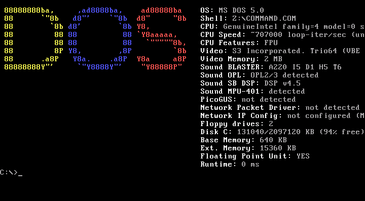

# dosfetch, a neofetch clone for DOS

A small DOS program that prints a system inventory — OS, CPU, memory,
disks, video, sound, network, and more — either to the screen (with a
neofetch-style ASCII logo) or as a plain-text report to a file, for
scripted/unattended collection.

Ported from the original Turbo Pascal 7 implementation (`dosfetch.pas`,
kept in this repo as a historical reference) to C, built with Open
Watcom for 16-bit real-mode DOS (`src/`). Real-mode with no DPMI
dependency, so it runs on the widest range of DOS-capable hardware and
boot configurations — from an original 8086 up through Pentium-class
machines.



## Features

- **System**: DOS vendor/version, shell (`COMSPEC`)
- **CPU**: staged detection safe on any 8086+ (never executes an
  instruction the CPU doesn't support) — vendor string, family/model/
  stepping and feature flags via CPUID where available, clock speed
  via the time-stamp counter on Pentium-class+ hardware, or a rough
  relative loop-throughput figure (explicitly labeled as such, never
  presented as a fake-precision MHz reading) on earlier CPUs
- **Memory**: base (conventional) and extended memory
- **Disks**: floppy drive count, and free/total space for every
  hard-disk-class drive letter from C: onward
- **Video**: adapter OEM string, VBE version, and video memory via
  VESA BIOS Extensions
- **Sound**: `BLASTER` environment variable, AdLib/OPL2/3 detection,
  Sound Blaster DSP version, MPU-401 presence
- **PicoGUS**: presence and current emulation mode (GUS/SB/AdLib/MPU/
  etc.) for this RP2040-based ISA sound card, if installed
- **Network**: packet driver presence (by interrupt vector), and IP/
  gateway configuration from mTCP's `CONFIG.MTC` if `MTCPCFG` is set
- **Runtime**: how long detection took, to help external tooling
  calibrate polling delays

Every hardware probe that could plausibly hang on absent/misbehaving
hardware (an empty floppy or CD-ROM drive, a Sound Blaster or MPU-401
that never answers) is either a pure memory/register read with no
"wait for a device" loop, or bounded with a hard iteration cap that
reports a clean failure instead of blocking forever — dosfetch is
meant to run unattended at boot, where an interactive prompt is
effectively a hang. A silent DOS critical-error handler is installed
before any disk code runs, so even an unexpected "not ready" condition
resolves itself instead of showing the interactive "Abort, Retry,
Fail?" prompt. See the comments in `src/disk.h` and
`src/critical_error.h` for the specifics.

A field that can't be determined reports an explicit `UNKNOWN` (or a
similarly explicit reason, e.g. `not detected`, `TIMEOUT`, `BLASTER
not set`) rather than a default or zero value, so a zero and a failed
detection are never confused with each other.

## Usage

```
dosfetch [options]

  --no-logo        Do not draw the ASCII logo
  --plain          Monochrome screen output, no logo (for OCR capture)
  -o, --out FILE   Also write a plain-text report to FILE
  -h, --help       Show this help
```

With no options, dosfetch draws the logo and fields to the screen, as
in the screenshot above. `-o FILE` additionally (or, combined with
`--plain`, instead) writes every field as one `Label: Value` line per
field to a plain text file — the format scripted/automated tooling
should parse: stable `Label: ` keys (do a key-based lookup, not a
positional one — future versions may add fields), plain decimal
numbers, no thousands separators.

## Building

You need [Open Watcom](http://www.openwatcom.org/) installed, with the
`WATCOM` environment variable set (as its own installer normally
does), or a copy of it available under `tools/watcom` in this repo:

```
make
```

This produces `dosfetch.exe`. Object files land in `build/`; `make
clean` removes both.

The original Pascal version (`dosfetch.pas`) still builds with Turbo
Pascal 6 or later (because of asm):

```
tpc dosfetch
```

## Copying

Originally written by Leah Neukirchen <leah@vuxu.org>.

To the extent possible under law, the creator(s) of this work have
waived all copyright and related or neighboring rights to this work.
See [LICENSE](LICENSE) (CC0 1.0 Universal), and
[THIRD-PARTY.md](THIRD-PARTY.md) for where outside material was
consulted (and why it doesn't affect that CC0 status).

Pull requests welcome!
